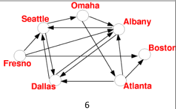

# Evolutionary Optimization Methods - Laboratory Work

The repository contains a set of laboratory works on various topics of evolutionary optimization methods. The work was carried out as part of the course of studying EOM in 2022 at the Department of Automated Control Systems of Donetsk National Technical University

Each laboratory work was performed in the [Google Colab](https://colab.research.google.com/?hl=ru_RU) environment in the Python programming language and using libraries `Numpy` and `Deap`

## Laboratory Work #1 - Simple Genetic Algorithm (l1-simple-ga)
A simple genetic algorithm has been developed to find the optimal value in the minimum of the function `(x - 1.0) * np.cos(3 * x - 15.0)` at `-10.0 <= x <= 10.0`. This work shows the implementation of a simple genetic algorithm using the Deep library.

You can test the work [here](https://colab.research.google.com/drive/1sZnKu_kStxYwgPl_h7vQbqRRSQ5gWqlX?hl=ru_RU)

## Laboratory Work #2 - Optimization Rastrigin function by Genetic Algorithm (l2-rastrigins-ga)
A genetic algorithm has been developed to optimize the Rastrigin function. The Rastrigin function is a non-convex function used as a performance verification task for optimization algorithms. The maximum value of the function for `x_i\in [-5.12, 5.12]` is in `x_i\in [+-4.5, ..., +-4.5]`.

[From Wikipedia, the free encyclopedia](https://en.wikipedia.org/wiki/Rastrigin_function)

When working with optimization problems in continuous spaces, it is quite natural to represent genes directly as real numbers. In this case, the chromosome is a vector of real numbers. Their accuracy will be determined exclusively by the bit grid of the computer on which the real-coded algorithm is implemented. The length of the chromosome will coincide with the length of the vector-the solution of the optimization problem, in other words, each gene will be responsible for one variable. The genotype of the object becomes identical to its phenotype.
The appearance of new individuals in the GA population is provided by several biological operators: selection, crossing and mutation. As operators of the selection of individuals into the parent pair, any known ones are suitable here: roulette, tournament, random. However, the crossing and mutation operators in classical implementations work with bit strings. Implementations that take into account the specifics of real-coded algorithms are needed.
It is also recommended to use the strategy of elitism – the best individual is preserved separately and is not erased when epochs change, while taking part in selection and recombination.

You can test the work [here](https://colab.research.google.com/drive/11KaswlmQNGfOLQTB9teb6LL3KfRtruat)

 [From Wikipedia, the free encyclopedia](https://upload.wikimedia.org/wikipedia/commons/8/8b/Rastrigin_function.png)

## Laboratory Work #3 - Traveling Salesman Problem (l3-tsp-ch130)
The traveling salesman problem is considered a classic problem of genetic algorithms. It consists in the following: a traveler (or a traveling salesman) must visit each of the basic set of cities and return to the starting point. There is a cost of tickets from one city to another. It is necessary to make a travel plan so that the amount of money spent is minimal. The search space for the CC is a set of N cities. Any combination of N cities where the cities are not repeated is a solution. The optimal solution is a combination whose cost (the sum of the costs of moving between each of the cities in the combination) is minimal.
Currently, there are three main representations of the path: neighbor, ordinal, and path. Each of these representations has its own completely different recombination operators.
Ordinal representation
The ordinal representation represents the tour as a list of n cities; the i-th element of the list is the number from 1 to n-i-1. The idea of an ordinal representation is as follows. There are several ordered lists of cities with, which serve as connection points for lists with an ordinal representation

[From Wikipedia, the free encyclopedia](https://upload.wikimedia.org/wikipedia/commons/c/c4/TSP_Deutschland_3.png)

You can test the work [here](https://colab.research.google.com/drive/11KaswlmQNGfOLQTB9teb6LL3KfRtruat)

## Laboratory Work #4 - Knapsack Problem (l4-dutyschedule) 
The knapsack problem is a problem in combinatorial optimization: Given a set of items, each with a weight and a value, determine the number of each item to include in a collection so that the total weight is less than or equal to a given limit and the total value is as large as possible. It derives its name from the problem faced by someone who is constrained by a fixed-size knapsack and must fill it with the most valuable items. The problem often arises in resource allocation where the decision-makers have to choose from a set of non-divisible projects or tasks under a fixed budget or time constraint, respectively.

In the work, the problem of packing a backpack was solved by the example of drawing up a duty schedule. Problem statement: Let it be required to make a weekly duty schedule. There are three shifts in a day – morning, afternoon and evening, and in each shift there must be at least one of the eight workers. Assign employees different roles (qualifications), take into account qualifications when assigning an employee.

A genetic algorithm was used in the work, the individual is a complete solution to the problem in the form of a one-dimensional array.

You can test the work [here](https://colab.research.google.com/drive/1g6WURBzX7TqZdHgymsRPZ0OA4ctWUBk4)

## Laboratory Work #5 - Evolution Strategy (l5-rastrigins-es)
This laboratory work is a modified algorithm of work No.2. In this paper, evolutionary strategies were used to optimize the objective function.

The evolutionary strategy operates with vectors of real numbers. When searching for a solution in the evolutionary strategy, mutation and crossing of individuals first occurs (see about mutation and crossing operators in the article Genetic Algorithm) to obtain descendants, then deterministic selection occurs without repetition of the best individuals from the general generation of parents and descendants. As a mutation, the addition of a normally distributed random variable to each component of the vector is often used, which turns the result into a covariance matrix. In this case, the parameters of the normal distribution are self-adapted during the execution of the algorithm (see Covariance matrix adaptation evolution strategy).

## Laboratory Work #6 - Swarm algorithms (l6-rastrigins-sa)
Also, this work is the finding of a function close to the optimal value using swarm algorithms

Swarm algorithms (RA), as well as evolutionary ones, use a population of individuals - potential solutions to the problem and a stochastic optimization method that is inspired by (models) the social behavior of birds or fish in a flock or insects in a swarm. Similarly to evolutionary algorithms, here the initial population of potential solutions is also randomly generated and then searched for (sub)the optimal solution to the problem in the process of performing RA. Initially, an attempt was made in RA to simulate the behavior of a flock of birds, which sometimes has the ability to suddenly and synchronously regroup and change the direction of flight when performing a certain task. Unlike GA, genetic operators are not used here, in RA individuals (called particles) fly in the process of searching in the hyperspace for solutions and take into account the successes of their neighbors. If one particle sees a good (promising) path (in search of food or protection from predators), then the other particles are able to quickly follow it, even if they were at the other end of the swarm.

## Laboratory Work #7 - TSP, Ant Colony Optimization (l7-ant-colony)
This work is a traveling salesman problem solved using ant algorithms. In this paper, it is necessary to find a Hamiltonian path in the graph. The graph is set using the file `aco_7.csv`, which contains the names of points, coordinates and relationships with other points.

An ant algorithm has been developed that finds the Hamiltonian path

You can test it [here](https://colab.research.google.com/drive/1c4moru0TMVx677jf9mbiMRJr0SkS9TZV)

